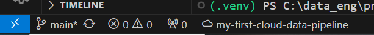

# My First Pipeline - Read Me First!
## Overview
In this project, we will cover the basics of a pipeline by covering the 3 parts of Extract, Transform and Load in its most basic fashion. All the tools covered in this project is 100% free to use.

### Phase 1 - Extract
Using Python locally to query data programatically from the WeatherAPI.
### Phase 2 - Transform
Using Python to transform the data, organising it so its ready to be loaded into a structured data warehouse such as Bigquery or a database such as SQL server.
### Phase 3 - Load
Using Python, we will load the data into Bigquery.
### Phase 4 - Visualise
Using Grafana cloud, we can visualise the data by querying the data in Bigquery.
### Phase 5 - Publish your First Project
Connect your code to github and share your work with others. 
<b>Be sure to not upload your API keys or secrets to github.</b>

### Technologies used
1. [Python](https://www.python.org/) - as this is the most common choice for Data Engineering at the moment.
2. [WeatherAPI](https://www.weatherapi.com/signup.aspx) - the free plan allows access to historical weather data for the last 5 days.
3. [Bigquery](https://cloud.google.com/bigquery/) - Bigquery [sandbox](https://cloud.google.com/bigquery/docs/sandbox#limits) lets you explore limited BigQuery capabilities at no cost to confirm whether BigQuery fits your needs. The BigQuery sandbox lets you experience BigQuery <b>without providing a credit card or creating a billing account for your project</b>. If you already created a billing account, you can still use BigQuery at no cost in the free usage tier.
4. [Grafana](https://grafana.com/products/cloud/) - sign up for the free forever plan

## Pre-requisites
1. Create a free [google account](https://accounts.google.com/signup/v2/webcreateaccount?hl=en-GB&flowName=GlifWebSignIn&flowEntry=SignUp/)
2. Install Python (latest stable version)
2. Install Git (latest stable version)
3. Install Visual Studio Code (latest stable version)
4. Install Google Cloud SDK (latest stable version)
5. In VSCode, click on the "Extensions" button on the left menu bar and install the following extensions:
    1. Google Cloud Code
    2. autopep8
    3. PowerShell
    4. Python
    5. TODO Highlight
6. Go to [WeatherAPI](https://www.weatherapi.com/signup.aspx) and sign up for a free 14-day trial. This will revert to a free membership after the 14 days so there's nothing to worry about.
7. Go to [Bigquery](https://console.cloud.google.com/bigquery) and sign in with your Google account.
8. Go to [Grafana](https://grafana.com/products/cloud/) and sign up for a free.

## Steps
### In Web Browser (Bigquery):
1. Upon entry of [Bigquery](https://console.cloud.google.com/bigquery), you will be prompted to create a new project. Create one and give it a meaningful name (e.g: my-data-pipeline). You will be coming back to this project in future steps.
2. Select the desired project (eg: my-data-pipeline)
3. Create a dataset (eg: weather-data)

### In the VSCode terminal:
1. First we want to clone the repository from github. To clone the repo, open the folder that you would want the repository folder created in and open a terminal. In the terminal, type in ```git clone https://github.com/pivot2dataengineering/my-first-cloud-pipeline.git```
2. Now in the top left bar in VSCode, click File and Open Folder and point it to the newly created repository folder.
3. Verify that your terminal prompt has "my-first-cloud-pipeline" at the end like so: d```C:\projects_folder\my-first-cloud-pipeline>```
1. Type in 
```gcloud init ```
2. Select 
```[1] Re-initialize this configuration ```
3. Select the correct account
4. Select the cloud project to use
5. Sign in with google cloud code at the bottom of the screen within VSCode



6. Create a virtual environment by typing ```python -m venv .venv ```
7. Activate the virtual environment by typing ```cd .venv/scripts/activate```
8. Install the required packages by typing ```pip install -r requirements.txt ```
### In Web Browser (WeatherAPI):
9. Go to [WeatherAPI](https://www.weatherapi.com/my/) and copy your API key. Replace the API key with your own API key in line 18 of extract_transform.py
### In the VSCode terminal:
10. Search for TODO tags in <i>extract_transform.py, load.py </i> & <i>main.py</i> and replace accordingly.
11. Press play on <i>extract_transform.py</i> or in the console type ```python extract_transform.py``` - This is print out a tidy table of weather data
12. Press play on <i>load.py</i> or in the console type ```python load.py``` - It might open up a browser for you to sign in with your google login once again.This should load some dummy data in bigquery.
13. Check in Bigquery console that the data has been uploaded and delete the table.
14. Press play on <i>main.py</i> or in the console type ```python main.py```. This will update the weather data for the date range entered into Bigquery.
### In Web Browser (Bigquery):
15. Refresh Bigquery and confirm the data has been updated.

### In Web Browser (Grafana cloud)
16. Head over to Grafana cloud and follow the instructions to connect to Bigquery and create a dashboard
17. This will involve creating a Service Account in google cloud to enable Grafana to access Bigquery
18. Once you tested your connection and its working, head over to dashboard and create your first dashboard and use the following SQL script.

```SQL
SELECT
  CAST(DATE AS TIMESTAMP) AS TIMESTAMP,
  MAX_TEMP,
  MIN_TEMP,
  AVG_TEMP,
  TOTAL_PRECIPITATION
FROM `my-first-cloud-data-pipeline.weather_data.melbourne_weather_table`
```
18. Chill out and pat yourself on the back for creating your first Cloud Data Pipeline.


